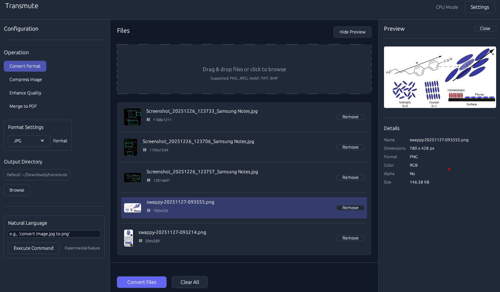

# Transmute

> **Privacy-focused, GPU-accelerated media converter** built in Rust

Transmute is a high-performance media conversion tool that processes images and PDFs locally on your machine with optional GPU acceleration. No cloud services, no telemetry, no network calls — your files never leave your device.

## Features

- **Format Conversion**: Convert between PNG, JPEG, WebP, TIFF, BMP, GIF, and PDF
- **Image Compression**: Optimize images with adaptive quality settings
- **Multi-Image to PDF**: Merge multiple images into a single PDF document
- **Batch Processing**: Convert multiple files in parallel with progress tracking
- **GPU Acceleration**: Optional GPU-accelerated processing via wgpu (Vulkan, Metal, DX12)
- **Natural Language Commands**: Execute conversions using natural language
- **CLI & GUI**: Choose between terminal interface or graphical application
- **Android Support**: JNI bridge for native Android integration
- **Privacy-First**: Zero network I/O, all processing happens locally
- **Configurable**: Persistent settings with TOML configuration file

## Screenshots

### User Interface

## Supported Formats

| Format | Input | Output | Compression | Notes                              |
| ------ | ----- | ------ | ----------- | ---------------------------------- |
| PNG    | Yes   | Yes    | Lossless    | Optimized with oxipng              |
| JPEG   | Yes   | Yes    | Lossy       | High-quality encoding with mozjpeg |
| WebP   | Yes   | Yes    | Both        | Modern compression format          |
| TIFF   | Yes   | Yes    | Both        | Supports multi-page documents      |
| BMP    | Yes   | Yes    | Lossless    | Uncompressed bitmap format         |
| GIF    | Yes   | Yes    | Lossless    | Animated GIF support               |
| PDF    | Yes   | Yes    | Document    | GPU-accelerated rasterization      |

## Platform Support

| Feature                  | Linux | macOS | Windows | Android         |
| ------------------------ | :---: | :---: | :-----: | :-------------: |
| CLI                      | ✅    | ✅    | ✅      | ❌              |
| GUI (egui)               | ✅    | ✅    | ✅      | ❌ (Kotlin UI)  |
| GPU acceleration         | ✅    | ✅    | ✅      | ❌              |
| Image conversion         | ✅    | ✅    | ✅      | ✅              |
| Image compression        | ✅    | ✅    | ✅      | ✅ (CPU-only)   |
| Images → PDF             | ✅    | ✅    | ✅      | ✅              |
| PDF → Images extraction  | ✅    | ✅    | ✅      | ❌ (see docs)   |
| Natural language commands| ✅    | ✅    | ✅      | ❌              |

## Documentation

- [Installation](docs/installation.md) — build requirements, install from source
- [CLI Usage](docs/usage-cli.md) — commands, flags, and examples
- [GUI Usage](docs/usage-gui.md) — walkthrough and keyboard shortcuts
- [GPU Acceleration](docs/gpu-acceleration.md) — backends, when it helps, how to disable
- [Configuration](docs/configuration.md) — config file locations and full TOML reference
- [Android](docs/android.md) — JNI bridge, what works, limitations, enabling features

## License

MIT License — see [LICENSE](LICENSE) for details

**Author**: [PsychoPunkSage](https://github.com/PsychoPunkSage)
